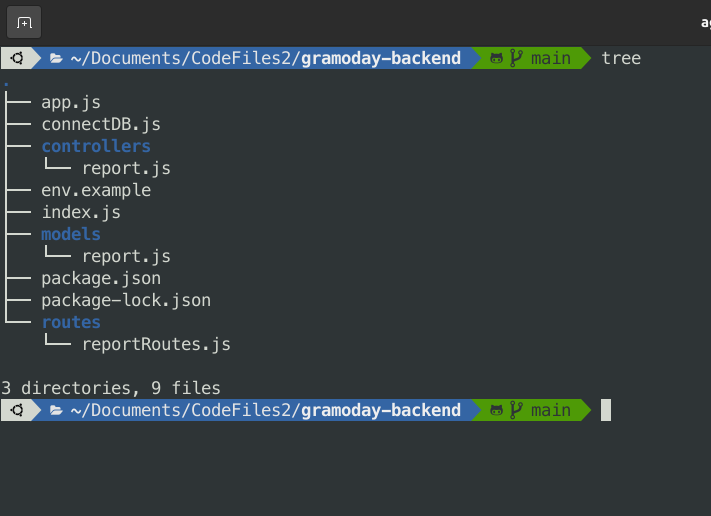

# GM-backend-task

Everything has been implemented well as the task was given in this [link](https://drive.google.com/file/d/11ilPtmrJi0lYeSTOB3B3j0PVJKf6uf-S/view)

## EXPLANATION 
A youtube video is right here for the [EXPLANATION](https://www.youtube.com/watch?v=o9war9ubFyY). 

## HEROKU DEPLOYMENT
It has been deployed on [heroku](https://backend-task-gramoday.herokuapp.com/)

## METHODS USED
Done using MVC (model, view, controller) method, and everything has been well broken into modules.
EDGE CASES covered:
1. Duplicate data elimination.
2. Form validation

## Instruction:

``` 
git clone https://github.com/surajchoubey/GM-backend-task
cd GM-backend-task/
npm install
npm run start
```

To test the application you can refer to this [link](https://drive.google.com/file/d/11ilPtmrJi0lYeSTOB3B3j0PVJKf6uf-S/view)
and send GET / POST request appropriately.

You can test via [heroku](https://backend-task-gramoday.herokuapp.com/) directly OR do it on your machine via deploying locally and checking it using [POSTMAN](https://www.postman.com/)


## FileSystem




